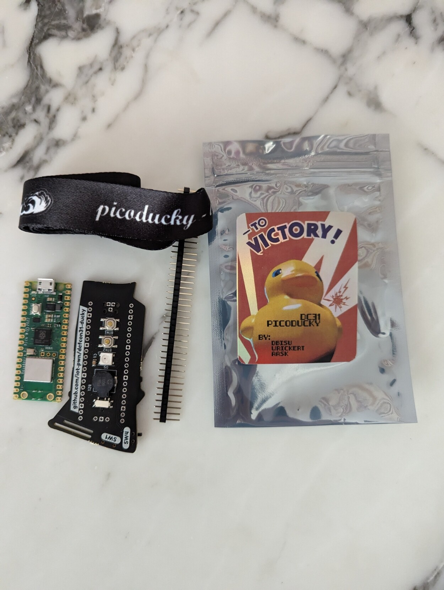

# DEF CON 31 Ducky

<insert picture of board>

## Quick Start Guide
Install and have your USB Rubber Ducky working in less than 5 minutes.

1. Download the latest release from the [Releases](https://github.com/iot-pwn/defcon31-ducky/releases) page.

2. Plug the device into a USB port while holding the boot button. It will show up as a removable media device named RPI-RP2.

3. Install CircutlPython on the Pico or Pico W. Copy `adafruit-circuitpython-raspberry_pi_pico_w-en_US-8.2.2.uf2` to the root of the Pico (RPI-RP2). The device will reboot and after a second or so, it will reconnect as CIRCUITPY.

4. Copy the lib folder to the root of the CIRCUITPY

5. Unzip `dc31-ducky.zip` to the root of the CIRCUITPY

6. Copy your payload as payload.dd to the root of the CIRCUITPY

7. Unplug the device from the USB port.

### Setup Mode
* To prevent payloads from running by default on boot, set SW1 to ON.

### USB Unhide mode
* By default, to avoid a conflict with the web app code, the Pico W will not show up as a USB Mass Storage device.
To have the Pico W show up on the host computer as a USB Mass Storage device, set SW2 to ON.  
* When in USB Mass Storage mode, the web app code will not be able to write payloads to the internal storage.

### Payload Selection
* The DC31 Ducky supports up to 4 payloads to be run on boot or when button1 is pressed.
* Use the 4 position switch to select the active payload.

### Button 1
* Button 1 will run the selected payload.

### Button 2
* Button 2 will make the connected Neopixel blick in multicolor mode.

Enjoy your DEF CON31 Ducky.

  

